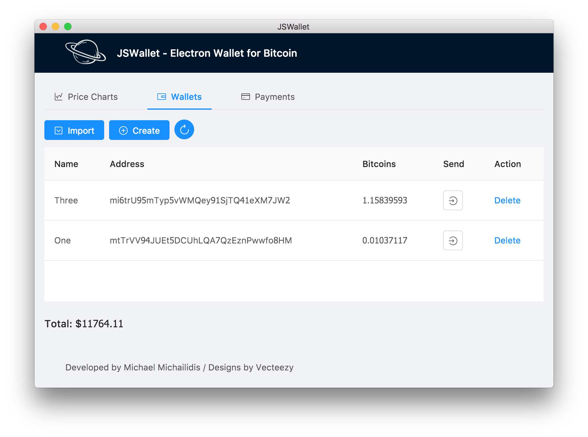

# JSWallet




This is a companion to my [Medium tutorial](https://medium.com/@michael.m/lets-create-a-secure-hd-bitcoin-wallet-in-electron-react-js-575032c42bf3).

It is **not** production code and should be used for educational purposes only.

## Installation

You need [Node.js](https://nodejs.org/) 24, the version in `.nvmrc` (with nvm: `nvm use`).

```
git clone https://github.com/mmick66/jswallet.git
cd jswallet
npm install
npm start
```

`npm start` runs the app from source, with the renderer served by Vite's dev server.

### Downloads

Installers for Windows, macOS (Apple silicon and Intel) and Linux are on the
[Releases](https://github.com/mmick66/jswallet/releases) page. They are **not code-signed** yet, so
the system warns before opening them the first time:

- **macOS**: unzip and open the app. When macOS says Apple could not verify it, go to
  *System Settings › Privacy & Security* and choose **Open Anyway** (on macOS 14 and older,
  right-click the app and choose **Open**).
- **Windows**: when SmartScreen says *Windows protected your PC*, choose **More info › Run anyway**.
- **Linux**: `sudo apt install ./jswallet_<version>_amd64.deb`, or
  `sudo dnf install ./jswallet-<version>-1.x86_64.rpm`.

Each release lists the files' SHA-256 checksums in `SHA256SUMS.txt`. Check a download with
`shasum -a 256 -c SHA256SUMS.txt --ignore-missing` (or `sha256sum -c` on Linux).

## Network

The wallet runs on Bitcoin's [testnet4](https://mempool.space/testnet4), where coins have no value.
It reads balances and history and broadcasts transactions through the [mempool.space](https://mempool.space) API.
To get test coins, send them to a wallet's address from a testnet4 faucet, such as the
[mempool.space faucet](https://mempool.space/testnet4/faucet) or [faucet.testnet4.dev](https://faucet.testnet4.dev).

The network is set in `src/env.json`:

```json
{
  "network": "testnet",
  "apiBase": {
    "bitcoin": "https://mempool.space/api",
    "testnet": "https://mempool.space/testnet4/api"
  }
}
```

- `network` picks the chain: `testnet` (testnet4) or `bitcoin` (mainnet, real money).
- `apiBase` holds the API of each network; the app uses the one that `network` names.
  It must be an `https:` URL on mempool.space: with any other URL the app turns its network features off.

The file is built into the app, so restart `npm start` or rebuild after changing it.
Each wallet belongs to the network it was created on, and the app lists only the wallets of the current one.

## Design Principles

Key derivation is the beating heart of a Bitcoin Wallet and most security concerns have to do with this first step.

My code is mainly intended as an illustration of the following pattern:


## Building

This project is built with [Electron Forge](https://www.electronforge.io/).

```
npm run make
```

builds the app and its installers for the platform you run it on, into `out/make`:
a zip on macOS, a Squirrel installer on Windows, and deb and rpm packages on Linux
(these need `dpkg` and `fakeroot`, and `rpmbuild`).
`npm run package` builds the app alone, into `out`.

### Releasing

1. Set the version: `npm version <x.y.z> --no-git-tag-version`.
2. Write the release notes in `docs/releases/<x.y.z>.md`.
3. Commit both, push, then tag the commit `<x.y.z>` and push the tag.

The [Release workflow](.github/workflows/release.yml) then checks the code, builds every installer
on its own platform, and publishes the GitHub release with the notes and `SHA256SUMS.txt`.
Without a notes file, it creates a draft with generated notes instead.

The workflow signs the installers once the signing credentials are in the repository's Actions
secrets and variables (listed at the top of the workflow): a Developer ID and App Store Connect API
key for macOS, and a SignPath project for Windows. Until then the macOS app is signed ad hoc and the
Windows installer is unsigned.

## Wallet storage

The wallets are kept in `db/wallets.db` inside the app's data folder:
`~/Library/Application Support/jswallet` on macOS, `%APPDATA%\jswallet` on Windows and `~/.config/jswallet` on Linux.
Older versions kept them in `db/wallets.db` next to wherever the app was started; on its first start the app
copies that file over and leaves the original where it was.

## Development

```
npm run check
```

runs ESLint and the tests.

## Warnings

As stated above this is **not** production code.
It is set to work with *testnet4* by default but by a simple change in `src/env.json` it could well function with real bitcoins!
